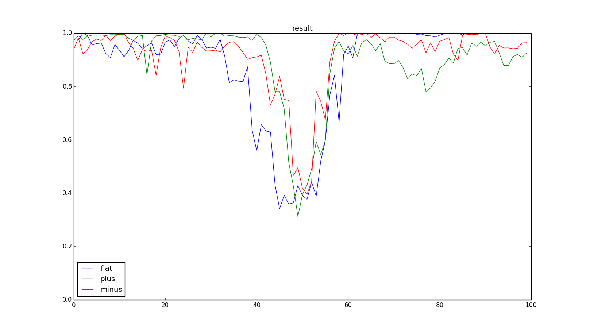

nupic_function_recognition
====

## 目的
+ nupicのnetwork apiを使って, 関数の分類をする.

## 目次
### 概要
+ 時系列データ( y=f(x) )を入力し, そのデータを作成した関数を判別するタスクを解く.
+ nupicのnetwrok apiを使い, 入力が(x, y), 出力が関数確率(softmax関数みたいな感じ)となるnetworkを作成する. このnetworkに対して, ある関数の出力f(x)をx=1からx=100まで入力する. これにより, (x,y)の時系列データから関数fを判別できるnetworkができる.
+ このnetworkは, たとえ同じ入力であっても, それまで入力された内容からどの関数であるかを判別できる. 例えば, 単調増加(y=x)と単調減少(y=100-x)について考えてみると, (x,y)=(50, 50)は単調増加/単調減少どちらの関数にも当てはまるので, (x,y)のみではその値が単調増加から得られたものか単調減少から得られたものかを判別することは出来ない. しかし, このnetworkでは, x=50以前の入力も考慮されるので関数を判別することができる.

### １層
+ 対象関数
  + 定数(const)     : y = 50
  + 単調増加(plus)  : y = x
  + 単調減少(minus) : y = 100-x

+ モデル
  + (SP) カラム数    : 2024
  + (SP) カラム発火数: 20(1%)
  + (TP) 1カラム当たりのセル数: 16

+ 評価指標
  + 平均正解率
  + 入力毎正解率

+ 結果
  + 平均正解率

    | function_type | accuracy_rate |
    | -----         | -----         |
    | flat          | 0.878         |
    | plus          | 0.897         |
    | minus         | 0.913         |

  + 入力毎正解率

   

### パラメータ調査
+ SPのカラム数変更
  + networkのカラム数を, 1012(10), 2024(20), 4048(40) と変更した. 括弧内は, 発火カラム数.
  + カラムを多くした場合, 多少改善する.
  + 少なくしたとき急激に結果が悪くなるのは, 入力(x,y)を表現しきれてない(異なる入力が同じSDRに丸め込まれていると思われる).

    | function_type | 1012(10) | 2024(20) | 4048(40) |
    | -----         | -----    | -----    | -----    |
    | flat          | 0.228    | 0.878    | 0.908    |
    | plus          | 0.360    | 0.897    | 0.912    |
    | minus         | 0.533    | 0.913    | 0.946    |

+ SPのカラム発火割合変更
  + カラム数2024をベースとして, カラム発火割合を0.5%, 1%, 2%と変更した.
  + つまり, 発火カラム数を, 10, 20, 40と変更する.
  + 発火カラム数が増加すると正解率は落ちた. これは, カラム数を少なくした時と同じように, 丸め込まれている可能性と, 発火カラム数が多くなったことで, TPの予測が上手く機能しなくなってしまった可能性がある. つまりSPで作られるはずの疎分散表現が上手く作られていない状態.
  + 発火カラム数が減少すると, 正解率が高くなった. しかし, 正解率が上昇したのは, x=0, 100に近い部分で, x=50に近い部分では正解率が落ちている. 
  これはつまり, 入力値に対する判別能力は上がっているが, 文脈(以前の入力)に対する判別能力は落ちているということだと思われる. 発火数が少なすぎてTPの予測が上手く機能しなかったかも. この状態でTPのセル同士の結合数を増やしたら上手く行くかもしれない.

    | function_type | 2024(10) | 2024(20) | 2024(30) | 2024(40) |
    | -----         | -----    | -----    | -----    | -----    |
    | flat          | 0.913    | 0.878    | 0.804    | 0.728    |
    | plus          | 0.960    | 0.897    | 0.783    | 0.614    |
    | minus         | 0.962    | 0.913    | 0.853    | 0.763    |

+ TPのセル数変更
  + カラム数2024をベースとして, TPのセル数を変更した.
  + 増やせば上がるし, 減らしたら下がるという状態.
  + 特に, x=50付近の正解率が変化している.

    | function_type | 4     | 8     | 16    | 32    | 64    |
    | -----         | ----- | ----- | ----- | ----- | ----- |
    | flat          | 0.794 | 0.855 | 0.878 | 0.892 | 0.898 |
    | plus          | 0.813 | 0.882 | 0.897 | 0.909 | 0.922 |
    | minus         | 0.866 | 0.905 | 0.913 | 0.946 | 0.949 |

### 多層
+ 構造
  + 1-1-1 構造
    + 同じ層を3つ重ねる.
    + 層同士の結合部分では, TPの出力をSPの入力としている.
  + 3-1 構造(同一encoder)
    + 同じencoderから3つの異なる層でSDRを作り, その3つを統合する層を作る.
    + 1-1-1と同様に, 層同士の結合部分では, TPの出力をSPの入力としている.
  + 3-1 構造(別encoder)
    + 異なるencoderから3つの異なる層でSDRを作り, その3つを統合する層を作る.
    + 1-1-1と同様に, 層同士の結合部分では, TPの出力をSPの入力としている.

+ 結果: 未実行
  + 1-1-1 構造
  + 3-1 構造(同一encoder)
  + 3-1 構造(別encoder)

### 関数増加
+ 追加関数
  + sin関数(sin)       :
  + 2次関数(quad)      :
  + ステップ関数(step) :

+ 

---

## CLA White Paper
+ 多分これ読んでないと何してるかよくわからんと思う.
+ [CLA White Paper](http://numenta.org/cla-white-paper.html)

## Install
+ だいたいここの通りにやればできた.
+ [nupic](https://github.com/numenta/nupic )

## tutorial
+ [nupic_tutorials](https://github.com/kokukuma/nupic_tutorials#network_api)
+ [nupic](https://github.com/numenta/nupic/tree/master/examples/network)

