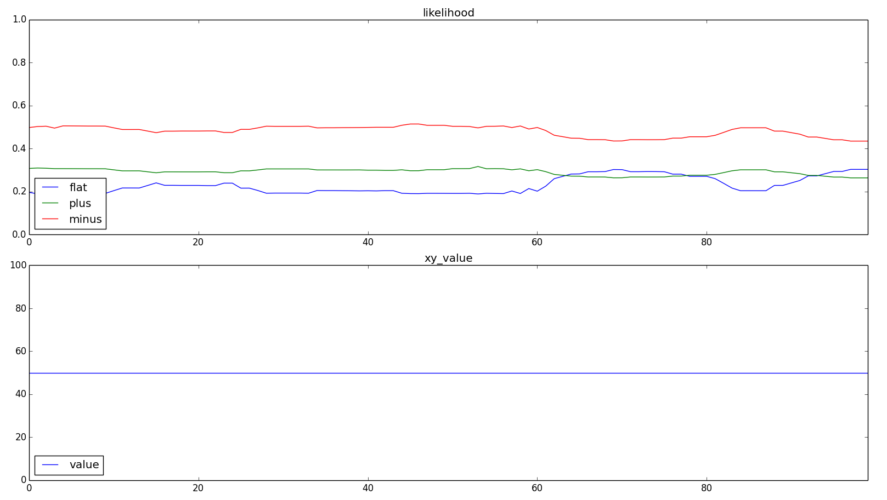
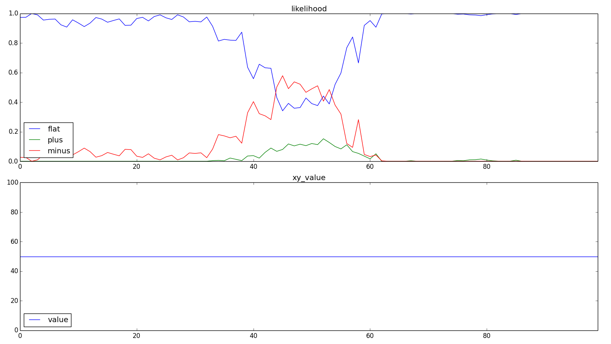
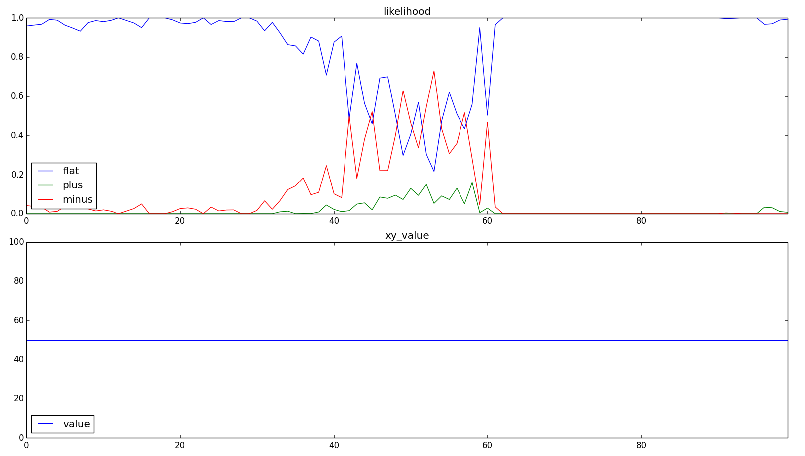

parameter
====

### SPのカラム数変更
+ networkのカラム数を, 1012(10), 2024(20), 4048(40), 8096(80) と変更した. 括弧内は, 発火カラム数.
+ 平均正解率
  + カラムを多くした場合, 多少結果が悪くなった.
  + 少なくしたとき急激に結果が悪くなるのは, SPで入力(x,y)を表現しきれてない(異なる入力が同じSDRに丸め込まれている)ためと思われる.

  | function_type | 1012(10) | 2024(20) | 4048(40) | 8096(80) |
  | -----         | -----    | -----    | -----    | -----    |
  | flat          | 0.228    | 0.878    | 0.908    | 0.889    |
  | plus          | 0.360    | 0.897    | 0.912    | 0.898    |
  | minus         | 0.533    | 0.913    | 0.946    | 0.955    |

+ 一番正解率が低い定数に置ける結果
  + 1012
    
  + 2024
    
  + 4048
    
  + 8096
    

### SPのカラム発火割合変更
+ カラム数2024をベースとして, カラム発火割合を0.5%, 1%, 2%と変更した.
+ つまり, 発火カラム数を, 10, 20, 40と変更する.
+ 平均正解率
  + 発火カラム数が増加すると正解率は落ちた. これは, カラム数を少なくした時と同じように, 丸め込まれている可能性と, 発火カラム数が多くなったことで, TPの予測が上手く機能しなくなってしまった可能性がある. つまりSPで作られるはずの疎分散表現が上手く作られていない状態.
  + 発火カラム数が減少すると, 正解率が高くなった. しかし, 正解率が上昇したのは, x=0, 100に近い部分で, x=50に近い部分では正解率が落ちている.
  これはつまり, 入力値に対する判別能力は上がっているが, 文脈(以前の入力)に対する判別能力は落ちているということだと思われる. 発火数が少なすぎてTPの予測が上手く機能しなかったかも. この状態でTPのセル同士の結合数を増やしたら上手く行くかもしれない.
  + 1~2%が妥当な範囲ということかな.

  | function_type | 2024(10) | 2024(20) | 2024(30) | 2024(40) |
  | -----         | -----    | -----    | -----    | -----    |
  | flat          | 0.913    | 0.878    | 0.804    | 0.728    |
  | plus          | 0.960    | 0.897    | 0.783    | 0.614    |
  | minus         | 0.962    | 0.913    | 0.853    | 0.763    |

### TPのセル数変更
+ カラム数2024をベースとして, TPのセル数を変更した.
+ 増やせば上がるし, 減らしたら下がるという状態.
+ 特に, x=50付近の正解率が変化している.

  | function_type | 4     | 8     | 16    | 32    | 64    |
  | -----         | ----- | ----- | ----- | ----- | ----- |
  | flat          | 0.794 | 0.855 | 0.878 | 0.892 | 0.898 |
  | plus          | 0.813 | 0.882 | 0.897 | 0.909 | 0.922 |
  | minus         | 0.866 | 0.905 | 0.913 | 0.946 | 0.949 |

