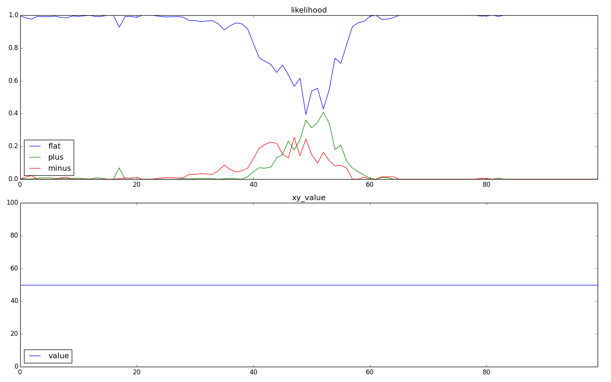
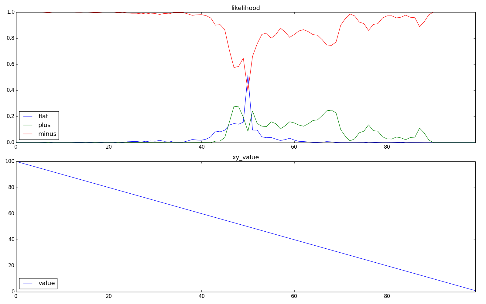
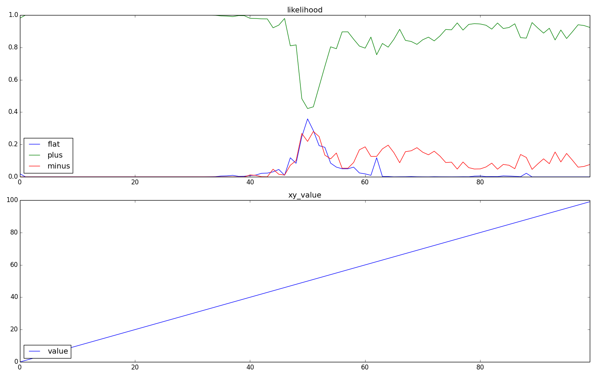
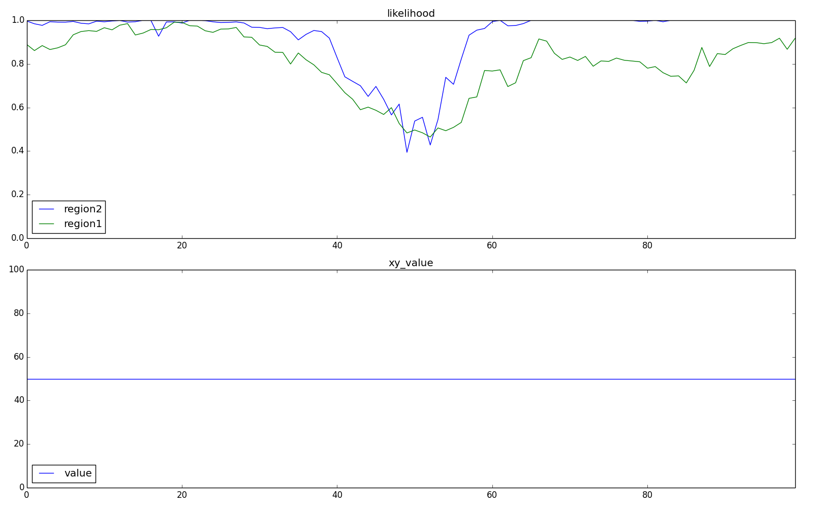
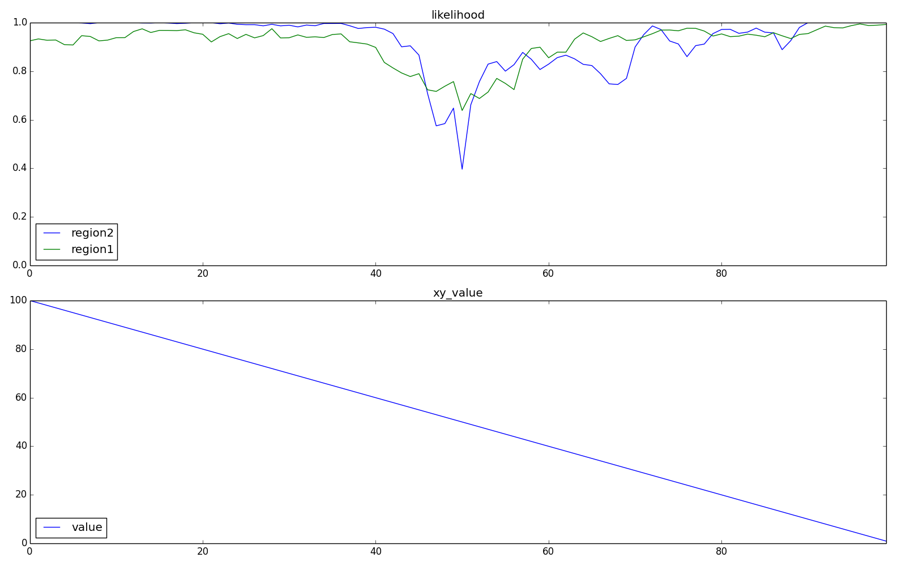
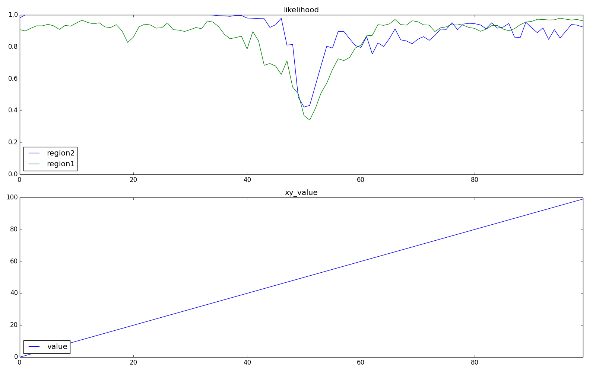

series_layer
====

### 概要
+ sinの分類をするため, 判別にもっと文脈を反映したい. その一つの方法として, 縦に層を重ねてみる. 層を重ねると,  ２層目の学習は, １層目で取得した文脈に基づいた入力の表現をもとに行われると予想.

### 対象関数
+ 定数(flat)     : y = 50
+ 単調増加(plus)  : y = x
+ 単調減少(minus) : y = 100-x

### モデル
+ CLA
  + (SP) カラム数    : 2025
  + (SP) カラム発火数: 20(1%)
  + (TP) 1カラム当たりのセル数: 8
  + 学習回数 : 100回
+ 層構造
  + 同じ層を2つ重ねる.
  + 層同士の結合部分では, TPの出力をSPの入力としている.

### 結果
#### 平均正解率
+ 2層目の方が全体的な結果は良くなっていることが分かる.

| function_type | 1 layer | 2 layer |
| -----         | -----   | -----   |
| flat          | 0.810   | 0.928   |
| plus          | 0.869   | 0.915   |
| minus         | 0.912   | 0.922   |

#### 入力毎正解率
+ 下記の図では下記内容が示されている.
  + 上: 入力xに対する関数毎の確率
  + 下: 入力x,yの関係
+ 結果
  + flatの(52,50) 付近において, 間違っている部分があるが,その他の点では上手く分離出来ていることが分かる.

  + flat
   

  + minus
   

  + plus
   

#### 入力毎正解率(layer毎の違い)
+ 下記の図では下記内容が示されている.
  + 上: 入力xに対するlayer毎の正解関数を選択する確率.
  + 下: 入力x,yの関係
+ 結果
  + x=0, x=100 付近にでは, 1層目より2層目の結果が良くなっていることが分かる.
  + x=50付近では, 2層目の方が悪い結果となっていることが分かる.

  + flat
   

  + minus
   

  + plus
   

### 結論
+ 交点周辺以外での正解率は上がるが, 交点周辺での正解率は下がる.
  + 交点周辺以外では１層の出力は異なったものとなる. 交点周辺での１層の出力は良く似通った出力となる. つまり直列層を追加することは, 異なっている部分は大きくなり, 似ている部分は同じものにまとめられる効果があるのかも.
  + もしくは, 交点付近は入力が似通っており, 他の関数を学習したときの影響が強く出るため, １層目において交点付近以外では出力が安定していて, 交点付近では出力が安定していないと考えられる. これによって, 2層目の交点付近の学習が上手く出来なかったのかもしれない.

