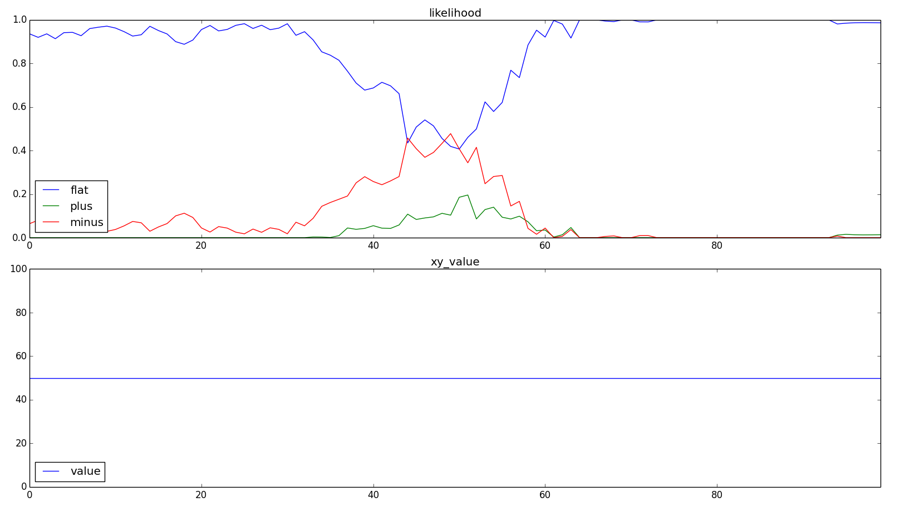
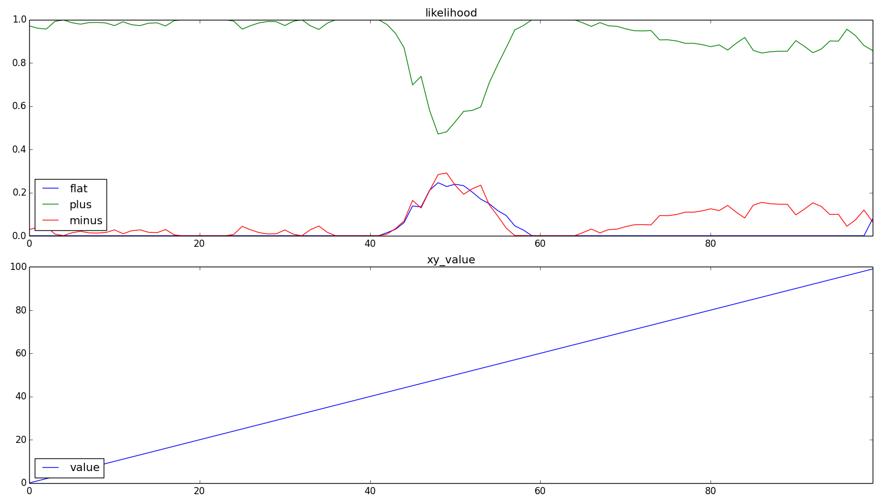
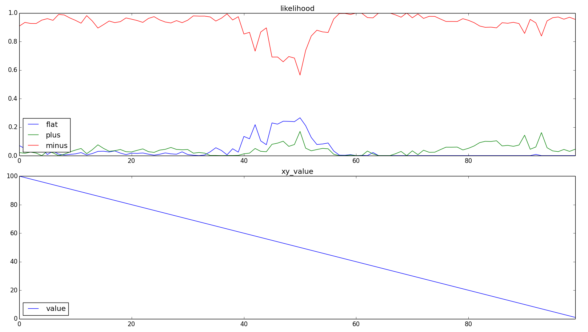

single
====

### 対象関数
+ 定数(flat)     : y = 50
+ 単調増加(plus)  : y = x
+ 単調減少(minus) : y = 100-x

### モデル
+ (SP) カラム数    : 4048
+ (SP) カラム発火数: 40(1%)
+ (TP) 1カラム当たりのセル数: 16
+ 学習回数 : 50回

### 評価指標
+ 平均正解率
+ 入力毎正解率

### 結果
+ 平均正解率

  | function_type | accuracy_rate |
  | -----         | -----         |
  | flat          | 0.908         |
  | plus          | 0.912         |
  | minus         | 0.946         |

+ 入力毎正解率
  + x=0, x=100付近ではよく判別できていることが分かる.
  + x=50付近では正解率が下がり, flatの一カ所においては不正解となっていることが, それ以外では判別できていることが分かる.
  + なぜ, 常にminusが最も正解率が良くなるのか?(下のパラメータ調査でも同様). 学習させる順番かな?
  + flat
   
  + plus
   
  + minus
   
