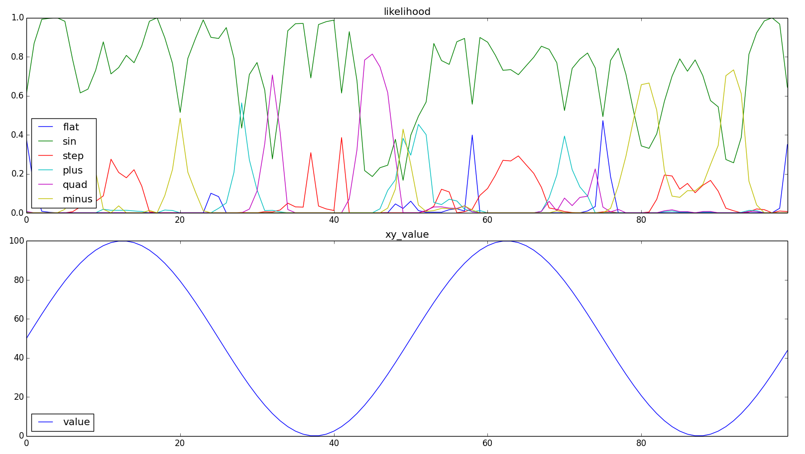
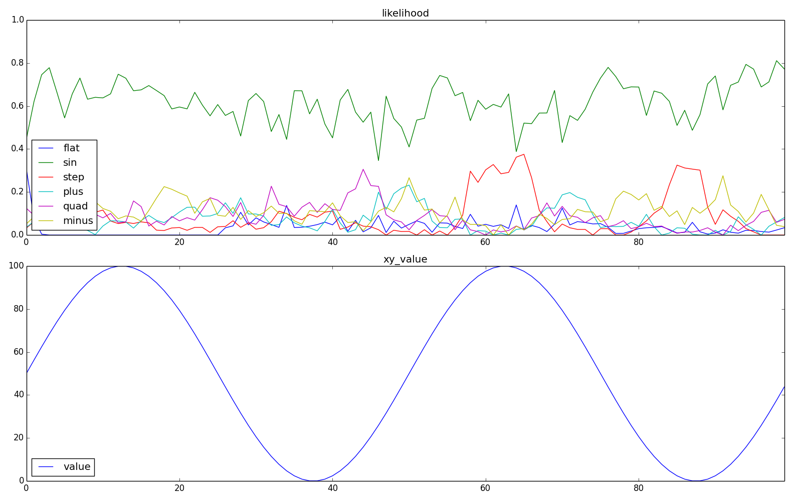

unit_learning
====

### 概要
+ 直列層の実験で分かったように, 層を重ねること自体は効果的だが下位層が安定していなければならない. また, 文脈の影響をより反映させるにはカラム中のセル数を増やさなければならない. しかし, セル数を増やすと出力が安定しなり, 層を重ねた効果が得られない. この問題への対処方法として, 1層目と2層目の学習タイミングを変更してみてはどうかと思った. deep learning のpre-trainingみたいな感じ.

### 対象関数
+ 定数(flat)     : y = 50
+ 単調増加(plus)  : y = x
+ 単調減少(minus) : y = 100-x

### モデル
+ CLA
  + (SP) カラム数    : 2025
  + (SP) カラム発火数: 20(1%)
  + (TP) 1カラム当たりのセル数: 8
  + 学習回数 : 50回(各層25回)
+ 層構造
  + 同じ層を2つ重ねる.
  + 層同士の結合部分では, TPの出力をSPの入力としている.
+ 学習タイミング
  + 下から順に学習する層を移動 (1層25回 -> 2層25回)
  + 下から順に学習する層を増加 (1層25回 -> 1,2層25回)
  + 上下それぞれの学習を繰り返す (1層->2層->1層->2層.....)

### 結果
#### 平均正解率
+ 下から順に学習する層を移動
  + 2層目の方が全体的な結果は良くなっていることが分かる.

  | function_type | 1 layer | 2 layer |
  | -----         | -----   | -----   |
  | flat          | 0.766   | 0.850   |
  | plus          | 0.844   | 0.900   |
  | minus         | 0.899   | 0.930   |

+ 下から順に学習する層を増加

  | function_type | 1 layer | 2 layer |
  | -----         | -----   | -----   |
  | flat          | 0.784   | 0.866   |
  | plus          | 0.858   | 0.889   |
  | minus         | 0.902   | 0.924   |

+ 上下だけの学習を繰り返す

  | function_type | 1 layer | 2 layer |
  | -----         | -----   | -----   |
  | flat          | 0.773   | 0.833   |
  | plus          | 0.847   | 0.917   |
  | minus         | 0.889   | 0.921   |

#### 入力毎正解率
+ 入力毎の正解率の状況をまとめると以下のような感じ.
  + 下から順に学習する層を移動 : x=0,100付近での結果は１層とそれほど変わらないが, x=50付近の結果が明らかに良くなっている.
  + 下から順に学習する層を増加 : 直列層の実験結果とほぼ同じような結果となっている(交点付近で結果が良くない).
  + 上下だけの学習を繰り返す   : 下から順に学習する層を増加した場合とほぼ同じような結果.

+ 下記の図では下記内容が示されている. また, 最も顕著な結果がでた, 下から順に学習する層を移動した場合のみを示す.
  + 上: 入力xに対する関数毎の確率
  + 下: 入力x,yの関係
+ 結果
  + x=0,100付近での結果は１層とそれほど変わらないが, x=50付近の結果が明らかに良くなっている.

  + flat
   

  + minus
   

  + plus
   

#### 入力毎正解率(layer毎の違い)
+ 下記の図では下記内容が示されている. また, 最も顕著な結果がでた, 下から順に学習する層を移動した場合のみを示す.
  + 上: 入力xに対するlayer毎の正解関数を選択する確率.
  + 下: 入力x,yの関係
+ 結果
  + x=0, x=100 付近にでは, 1層目より2層目の結果が良くなっていることが分かる.
  + x=50付近でも, おおむね２層目の方が良い結果になっていることが分かる.

  + flat
   

  + minus
   

  + plus
   

### 対象関数増加
+ ここまでいい結果が出たので, [関数増加](docs/add_function.md) と同じように関数を増やした場合も実施してみた. モデル条件は同じ. 学習タイミングは, 1で行った.

+ 結果
  + 下の図に示すように, このやり方だとsinも上手く判別できることが分かる.
  + また, flatに置ける差も小さくなっている. なぜ差が出るのかは不明だが.

  + 1層構造
  

  + 2層構造 + 層毎に学習
  

### 結論
+ 1層をある程度学習させた後, 2層を学習させることでsinまで判別できることが分かった.
  + 思い返してみると, White Paperにもそのようなことが示唆されていたな.
  + ただ, 上下だけの学習を繰り返すの結果が悪くなっていたことから, 1層目を再度学習させようとすると, これまで２層目で学習してきたことを破棄しないと結果がでないのではないかと思う. また, オンライン学習ができなくなるのではという懸念がある.
  + センサーを簡単なものに分離し(e.g. xyのベクトルとして入力するのではなく, x,yをそれぞれ入力するような形), 最初にがっつり学習させて, 3層目の学習が始まったら, もう２度と１層目を学習させないとかだったら問題にはならないが, 制限を増やすことになるので頂けない.
  + 1層目の出力が安定しないために, 2層目の学習が上手く出来ないのであれば, １層目の学習速度を２層目より遅くしておいたら, ２層目の学習速度に対して1層目の出力がそこまでぶれないから上手く学習できるようになったりしないかな.

